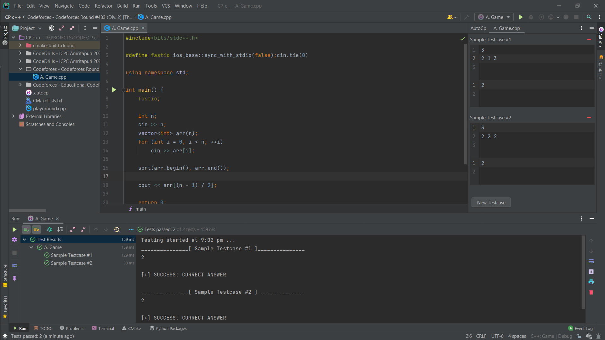

<!--suppress HtmlDeprecatedAttribute -->
<div  align="center">


# AutoCp

Competitive Programming Plugin for Intellij-Based IDEs


[](https://plugins.jetbrains.com/plugin/17061-autocp)
[](https://plugins.jetbrains.com/plugin/17061-autocp)

</div>

[Plugin Homepage](https://plugins.jetbrains.com/plugin/17061-autocp)
<!-- Plugin description -->
__Generates files and judges your solutions while Competitive Programming.__

Problems and Contests from these [contest websites](https://github.com/jmerle/competitive-companion#supported-websites) are supported. If you come across bugs or have feature requests, please raise
an [issue](https://github.com/Pushpavel/AutoCp/issues/new) on our GitHub repository.

### Quick Start

- Make sure you had installed [Competitive Companion](https://github.com/jmerle/competitive-companion).
    - [Chrome extension](https://chrome.google.com/webstore/detail/competitive-companion/cjnmckjndlpiamhfimnnjmnckgghkjbl)
    - [Firefox add-on](https://addons.mozilla.org/en-US/firefox/addon/competitive-companion/)
- Create solution files by ```Tools``` > ```Gather Problems```
- Program your solution 😎
- Open ```View``` > ```Tool Windows``` > ```AutoCp``` to view and edit your testcases
- Right-click your solution file and run using AutoCp ️

### Features

- Generate files from [contest websites](https://github.com/jmerle/competitive-companion#supported-websites)
- Supports File Templates
- Supports all Programming languages supported by the IDE.some might need setup.
- Supports sample Testcase editor
- Results are presented in Test Runner UI built in the IDE.

<!-- Plugin description end -->

### Installation

Manually installing the plugin would give you the latest version at least a day earlier than IDE built-in plugin system

- __Using IDE built-in plugin system:__

    - Include pre-release versions (required)
        - <kbd>Settings/Preferences</kbd> > <kbd>Plugins</kbd> > <kbd>⚙️</kbd> > Manage Plugin Repositories...
        - Add <https://plugins.jetbrains.com/plugins/eap/list> to the list
    - <kbd>Settings/Preferences</kbd> > <kbd>Plugins</kbd> > <kbd>Marketplace</kbd> > <kbd>Search for "AutoCp"</kbd> >
      <kbd>Install Plugin</kbd>


- __Manually:__

  Download the [latest release](https://github.com/Pushpavel/autoCP/releases/latest) and install it manually using
  <kbd>Settings/Preferences</kbd> > <kbd>Plugins</kbd> > <kbd>⚙️</kbd> > <kbd>Install plugin from disk...</kbd>

### Screenshot



### ```.autocp``` file

This file stores the problems and testcases you gathered using <kbd>Gather Problems</kbd> Action. It is very crucial to
this plugin and should not be touched.

### File Structure

<kbd>Gather Problems</kbd> Action generates solution files inside a folder named by
the ```<judge> - <category/contest>``` that the problem belongs to.

> Moving or renaming files will unlink the solution file to its problem
> This restriction will be removed

### Limitations

Hopefully, these limitations will be removed soon.

- Memory Limit is ignored.
- Strict File Structure
- No Debugging through AutoCp
- Only files created by AutoCp can be run by AutoCp

### Help? 😀

- If you've noticed a bug or have a feature request,
  consider [opening a new issue](https://github.com/Pushpavel/AutoCp/issues/new).
- Use [discussions](https://github.com/Pushpavel/AutoCp/discussions) for questions.

### Contributing

See something that's wrong or unclear?, Pull requests are welcome 😀

Read the [contributing guide](CONTRIBUTING.md) to learn how you can take part in improving ```AutoCp```

### License

The scripts and documentation in this project are released under the [MIT License](LICENSE)

---
Plugin based on the [IntelliJ Platform Plugin Template][template].

[template]: https://github.com/JetBrains/intellij-platform-plugin-template
