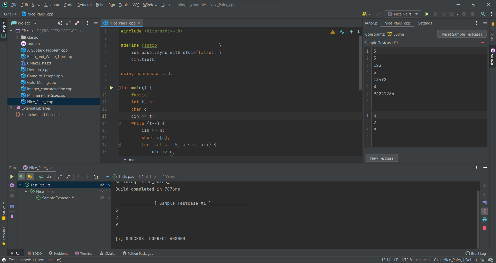

# Introduction

AutoCp is a plugin for productive competitive programming contests. It generates files from templates and judges your
solutions against testcases gathered from the problem webpage
via [Competitive Companion](https://github.com/jmerle/competitive-companion#install) extension. Learn what AutoCp is
about on the [homepage](../README.md).

#### About Plugin

Plugin based on the [IntelliJ Platform Plugin Template][https://github.com/JetBrains/intellij-platform-plugin-template].

#### About Documentation

Documentation is inspired from and also built by [VuePress](https://v2.vuepress.vuejs.org/)

#### License

The scripts and documentation in this project are released under
the [MIT License](https://github.com/Pushpavel/AutoCp/blob/gh-pages/LICENSE)