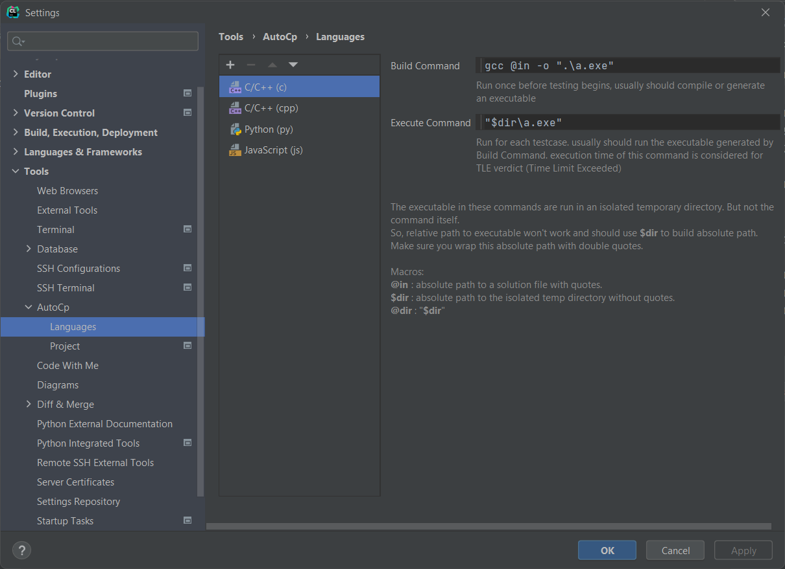

# Commands

You can customize the default build and execute commands for your programming language if you are using a different
build tool or to edit its arguments.These defaults are set according to the compilers or interpreters found in your
system. [more about defaults](getting-started.md#programming-language)

Navigate to the language settings to edit the commands.

```Settings/Preferences``` > ```Tools``` > ```AutoCp``` > ```Languages```



These commands are used while running a solution file with AutoCp Run Configuration.

### Build Command

Run once before testing begins, usually should compile or generate an executable.

### Execute Command

Run for each testcase. usually should run the executable generated by Build Command. execution time of this command is
considered as the execution time of a testcase.

### Macros that can be used in these commands

| Macro      | Expands to                                                   |
| ---------- | ------------------------------------------------------------ |
| ```@in```  | absolute path to a solution file with quotes.                |
| ```$dir``` | absolute path to the isolated temp directory without quotes. |
| ```@dir``` | "```$dir```"                                                 |