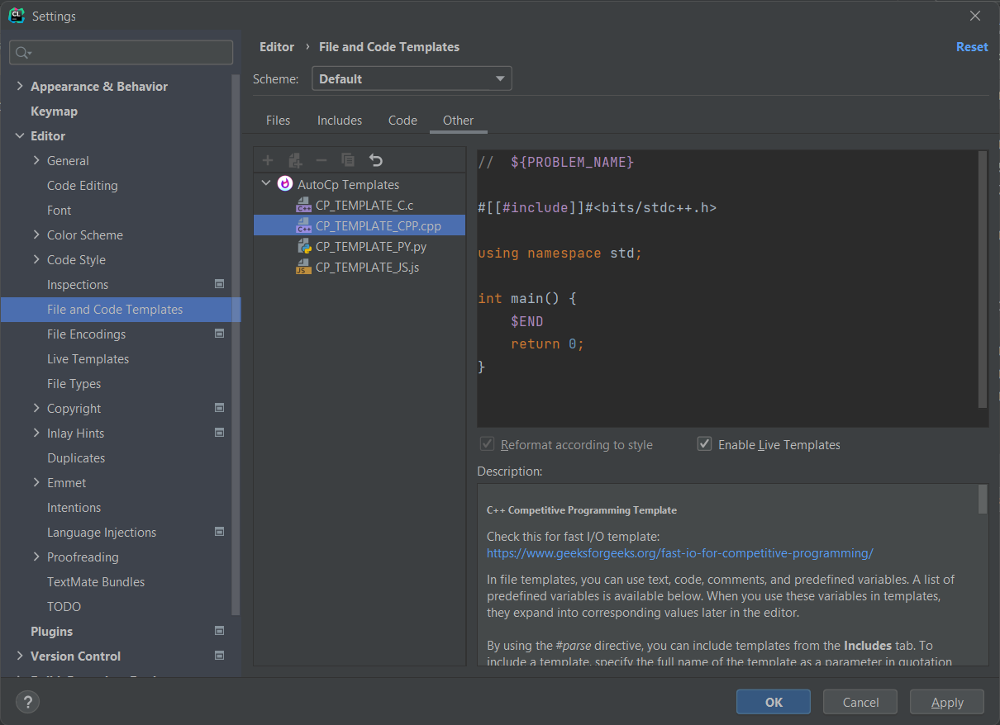

# File Templates

AutoCp comes with simple file templates that can be optimized for your liking. It uses the
built-in [file templates](https://www.jetbrains.com/help/clion/settings-file-and-code-templates.html) system of the IDE.
In file templates, you can use text, code, comments, and predefined variables.

### Edit existing file templates

Each template name is of the format ```CP_TEMPLATE_{FILE_EXTENSION_IN_CAPITALS}.{file_extension}```<br>
(ex - ```CP_TEMPLATE_CPP.cpp```). This template will be used for generating files with the ```{file extension}```
. Refer IDE docs on [File Templates](https://www.jetbrains.com/help/clion/using-file-and-code-templates.html#syntax) for
syntax.

```Settings/Preferences``` > ```Editor``` > ```File and code templates``` > ```Other```
tab > ```AutoCp Templates```



### Predefined Template Variables

A list of predefined variables provided by autocp is available below. When you use these variables in templates, they
expand into corresponding values later in the editor.

| Variable                    | Description                                                                   |
| --------------------------- | ----------------------------------------------------------------------------- |
| ```${PROBLEM_GROUP_NAME}``` | Contest or category name of the problem for which this file template is used  |
| ```${PROBLEM_NAME}```       | Name of the Problem for which this file template is used                      |
| ```${ONLINE_JUDGE_NAME}```  | Name of your online judge for (for example, CodeChef, Codeforces, and so on). |
|                             |[...more IDE defined variables](https://www.jetbrains.com/help/clion/settings-file-and-code-templates.html#:~:text=%24%7BCALL_SUPER%7D,Current%20year)|

__C++ file template__

@[code velocity](../../src/main/resources/fileTemplates/j2ee/CP_TEMPLATE_CPP.cpp.ft)