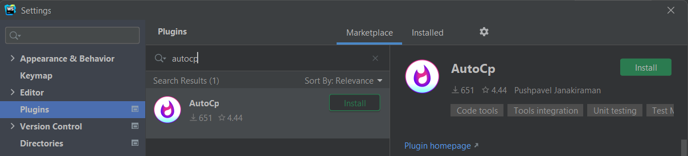
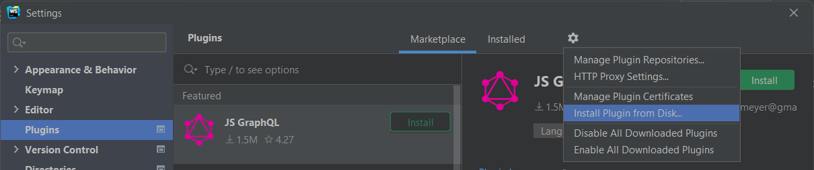
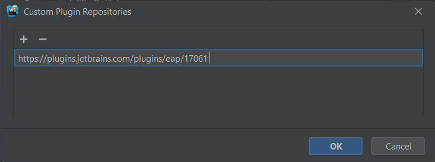

# Getting Started

If you come across bugs or have feature requests, please raise
an [issue](https://github.com/Pushpavel/AutoCp/issues/new/choose) on our GitHub repository.

## Prerequisites

#### Competitive Companion

- [__Chrome
  extension__](https://chrome.google.com/webstore/detail/competitive-companion/cjnmckjndlpiamhfimnnjmnckgghkjbl)
- [__Firefox add-on__](https://addons.mozilla.org/en-US/firefox/addon/competitive-companion/)

## Installing the plugin

### Direct Install

Open your IDE and install AutoCp by clicking the button below.

<InstallButton></InstallButton>

### From IDE Settings

```Settings/Preferences``` > ```Plugins``` > ```Marketplace``` tab > ```Search for "
AutoCp"``` > ```Install Plugin```



### From GitHub Releases

Download the [latest release](https://github.com/Pushpavel/AutoCp/releases) and install it manually using

```Settings/Preferences``` > ```Plugins``` > ```⚙️``` > ```Install plugin from disk...```



:::: details Install EAP version to try out the latest features

::: danger Caution

EAP releases might contain bugs. Please file an [issue](https://github.com/Pushpavel/AutoCp/issues/new/choose) in that
case.
:::

#### Add pre-release channel

Navigate to
```Settings/Preferences``` > ```Plugins``` > ```⚙️``` > ```Manage Plugin Repositories...```

And add the below url

```url
https://plugins.jetbrains.com/plugins/eap/17061
```



#### Install plugin

you can either follow [Direct Install](#direct-install) or [From IDE Settings](#from-ide-settings)
::::

## Programming Language

AutoCp will look for popular compilers or interpreters of your programming language from the system ```PATH``` variable
and sets up the commands and file templates automatically.If it could not find anything, you might be required to set
this up yourself.

::: tip

AutoCp plugin is not bundled with any build tool.
:::

#### Default Build Tools

This list only includes the already setup programming languages and build tools. You could easily set this up manually
for your programming language or build tool by adding [Commands](commands.md) of your build tool.

| Programming Language | Build Tools |
| --------- | ------- |
| C | [gcc][gcc], [clang][clang] |
| C++ | [g++][g++], [clang++][clang++] |
| Java | [javac][javac] |
| Python | [python][python] |
| Kotlin | [kotlinc][kotlinc] |
| Rust | [rustc][rustc] | 
| C# | [csc][csc] |
| Javascript | [d8][d8], [node][node] |

Didn't find your programming language or build tool ? File
an [issue](https://github.com/Pushpavel/AutoCp/issues/new/choose) to add it.


[gcc]: https://gcc.gnu.org/install/binaries.html

[clang]: https://clang.llvm.org

[g++]: https://www.cs.odu.edu/~zeil/cs250PreTest/latest/Public/installingACompiler/

[clang++]: https://www.ics.uci.edu/~pattis/common/handouts/macclion/clang.html

[javac]: https://en.wikipedia.org/wiki/Javac

[python]: https://www.python.org/downloads/

[kotlinc]: https://kotlinlang.org/docs/command-line.html

[rustc]: https://www.rust-lang.org/tools/install

[csc]: https://dotnet.microsoft.com/download

[d8]: https://v8.dev/

[node]: https://nodejs.org/en/download/