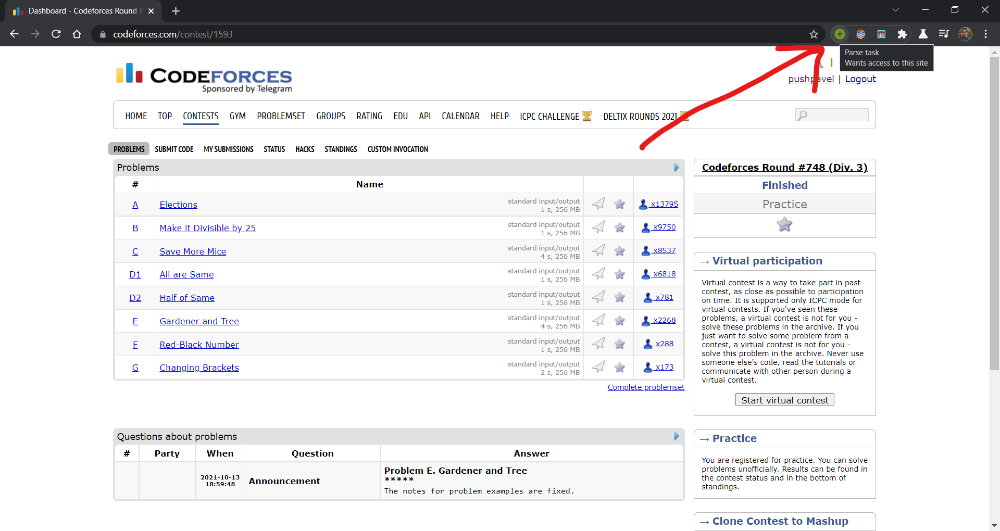
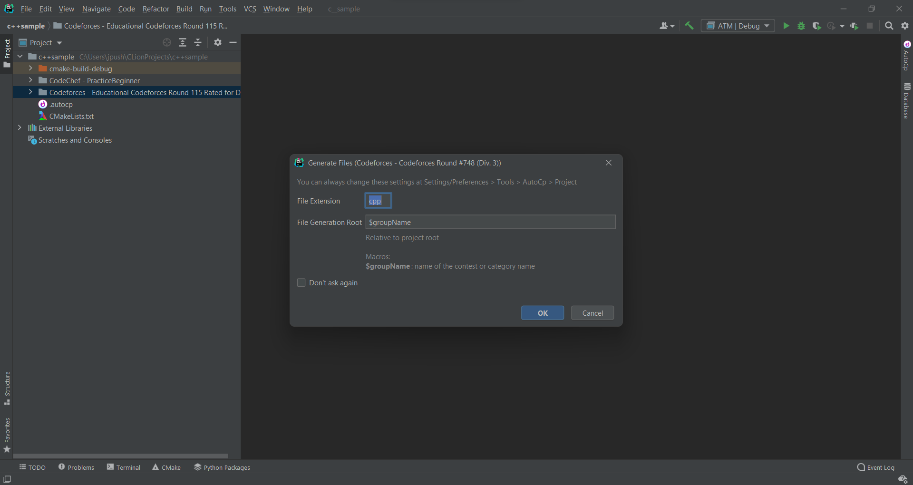
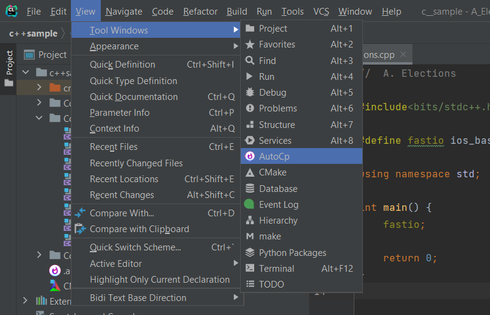

# Usage

::: tip

If you haven't already, have a look at [Getting Started](getting-started.md)
for installation and configuration.
:::

You must create the IDE project before continuing with the instructions.You may select any options in the project creation wizard. Once created, you can reuse the same project for any number of contests. 

## Creating Files

- Go to the contest or problem page in your browser.
- With your IDE project open, activate Competitive Companion browser extension.
  

- It takes about 2-3 seconds for the __Generate Files__ dialog to show. Files are created in the background, so you can
  start coding as soon as you click OK.

  

## Editing testcases

Open Testcase viewer
```View``` > ```Tool Windows``` > ```AutoCp```



## Judging Solution


Open your solution file and run by right-clicking on it (<kbd>Alt</kbd> + <kbd>X</kbd>).


Of course, you can also run it with C/C++ file, you can just choose the source file and the clion will automatically give the name same as the file to the run configuration.


